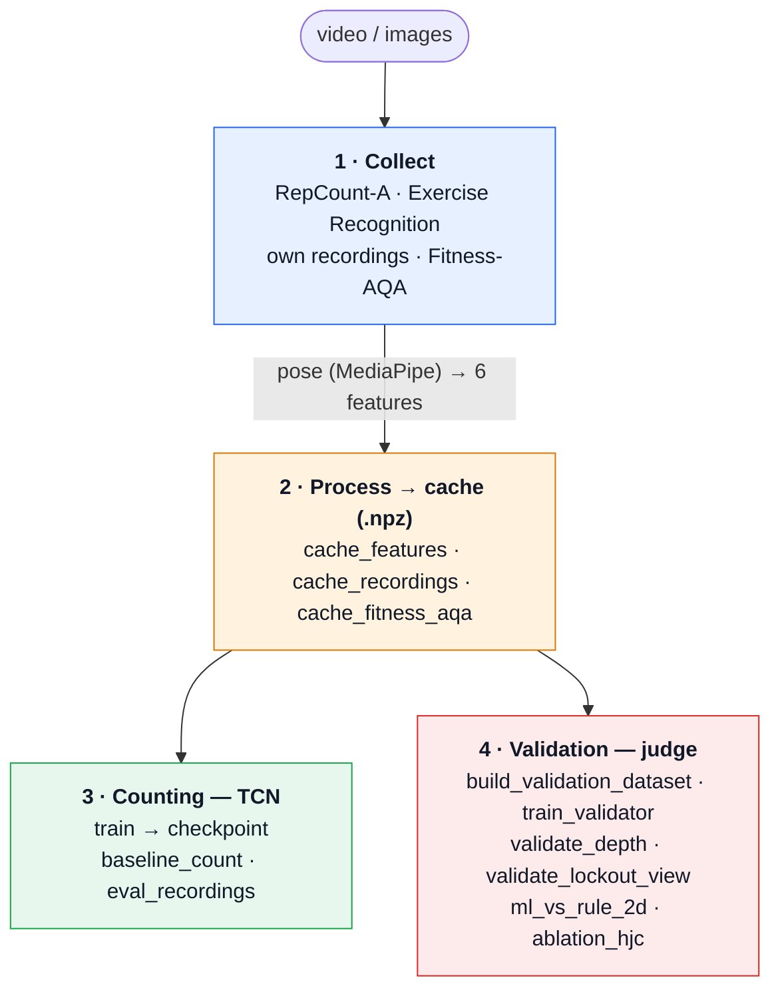

# juez-crossfit

**Automatic judge for CrossFit squats (Back Squat)** using computer vision, in real
time and from a conventional camera. BSc thesis in Data Science (UNIR) by Iván
Rodríguez Calleja.

The system estimates body pose with MediaPipe, summarizes it into a small set of
per-frame kinematic features and, on that sequence, does two things:

- **Rep counting** with a lightweight temporal convolutional network (TCN) that
  regresses a density map and counts its peaks.
- **Validation of each rep** (REP / NO-REP) against the two rulebook criteria
  —depth and hip extension (lockout)—, with an explainable judge that combines
  interpretable rules and a classifier, and reports which criterion fails.

This repository holds the research code (data, models, experiments). The real-time
web demo app lives in a separate repository.

## Structure

The code is organized **by movement** (`squat/`) and, within each one, into layers
following domain-driven design (DDD) and SOLID principles, so that the pieces (pose
estimator, model, datasets) are interchangeable through interfaces:

- `squat/domain/`         — entities, value objects, interfaces (ports) and the
  kinematic features and validity criteria of the squat. No external dependencies.
- `squat/application/`    — use cases (extract features, density target,
  counterfactual augmentation).
- `squat/infrastructure/` — concrete adapters: `pose/` (MediaPipe), `video/`
  (OpenCV), `datasets/` (RepCount, Exercise Recognition, Fitness-AQA), `model/`
  (TCN). They implement the domain interfaces.
- `squat/scripts/`        — command-line programs, one per pipeline phase.
- `squat/data/`, `squat/checkpoints/` — data and models (not versioned).

The generic pieces (pose, video, model) are written in a movement-agnostic way; when
a second exercise is added they would be promoted to a common module.

## Pipeline

The work is organized into four chained phases. Pose estimation (the most expensive
step) runs only once in phase 2 and is cached; everything else builds on that cache.



## How to run the pipeline

With the environment created (see *Environment*) and the data in place (see *Data*),
the phases run in order. Every program is launched with the environment's
interpreter:

```bash
# 2) Process the data → feature cache (.npz)
./.venv/bin/python squat/scripts/cache_features.py repcount <path_to_repcount-a>
./.venv/bin/python squat/scripts/cache_recordings.py          # own recordings
./.venv/bin/python squat/scripts/cache_fitness_aqa.py         # multi-subject depth
# (optional, only for the weak-label ablation)
# ./.venv/bin/python squat/scripts/cache_features.py exrec <path_to_exercise-recognition>

# 3) Counting
./.venv/bin/python squat/scripts/train.py                     # train the TCN → checkpoint
./.venv/bin/python squat/scripts/baseline_count.py <path_to_repcount-a> test   # signal-based baseline
./.venv/bin/python squat/scripts/eval_recordings.py           # evaluate on the recordings

# 4) Validation (judge)
./.venv/bin/python squat/scripts/build_validation_dataset.py  # per-rep dataset
./.venv/bin/python squat/scripts/train_validator.py           # rules vs classifier
./.venv/bin/python squat/scripts/validate_depth.py            # depth (Fitness-AQA)
./.venv/bin/python squat/scripts/validate_lockout_view.py     # lockout by view
./.venv/bin/python squat/scripts/ml_vs_rule_2d.py             # ML vs rule (2D features)
./.venv/bin/python squat/scripts/ablation_hjc.py              # hip-center ablation
```

## Environment

Python 3.11 (required by MediaPipe). Managed with [uv](https://docs.astral.sh/uv/):

```bash
uv venv --python 3.11
uv pip install -e .
```

Includes PyTorch (with MPS acceleration on Apple Silicon), MediaPipe, OpenCV, NumPy,
SciPy and scikit-learn.

## Data

The data is **not versioned** (size, licenses and privacy); the `.gitignore` excludes
it. Each source is used according to how reliable its label is (details in the thesis
report) and is placed under `squat/data/` or has its path passed to the script:

- **RepCount-A** (Hu et al., 2022): counting (training and test). Public.
- **Exercise Recognition** (Riccio, 2024): counting, only as an ablation. Public.
- **Fitness-AQA** (Parmar et al., 2022): multi-subject depth validation.
  Restricted-access research dataset.
- **Own recordings**: real-world counting validation and test. Not published
  (subject privacy).

## Reproducibility

Each phase has its script in `squat/scripts/` and operates on the already-cached
features, so the experiments start from exactly the same data. Dependency versions
are pinned in `pyproject.toml`.
